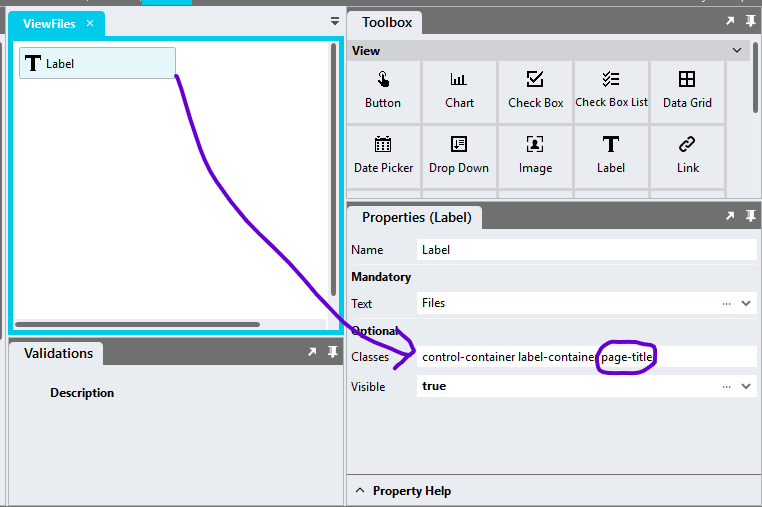

# Built-In CSS Classes

A list of CSS classes that are built into the Stadium stylesheet and can be attached to controls to make the styling of frequently needed UI elemnts simpler and faster. 

## Table of Contents
1. [Usage](#usage)
2. [Classes](#classes)
    1. [Page Title](#page-title)
    2. [Secondary Button](#secondary-button)
    3. [Tertiary Button](#tertiary-button)
    4. [Grid or Flexbox Items Center Alignment](#grid-or-flexbox-items-center-alignment)
    5. [Text Center Alignment](#text-center-alignment)
    6. [Bold](#bold)
    7. [Underline](#underline)
    8. [Italic](#italic)
    9. [Capitalize](#capitalize)
    10. [Lowercase](#lowercase)
    11. [Uppercase](#uppercase)
    12. [X-Small Text](#x-small-text)
    13. [Smaller Text](#smaller-text)
    14. [Small Text](#small-text)
    15. [Larger Text](#larger-text)
    16. [Large Text](#large-text)
    17. [X-Large Text](#x-large-text)
    18. [Divider](#divider)
    19. [Border](#border)
    20. [Top Border](#top-border)
    21. [Bottom Border](#bottom-border)

## Usage
1. Check the Enable Style Sheet checkbox in the application properties
2. Add any class below to the Control `classes` property
3. To change the default styling of the listed classes
    1. Add the [Theming](https://github.com/stadium-software/theming-kit)
    2. Change variables used in the respective classes

**NOTE:** Changing the values of listed variables will usually affect the entire theme



## Classes

### Page Title
Turn a `Label` control into a page title

**Class name**
```css
page-title
```

**Variables**
```css
--FONT-SIZE-PAGE-TITLE;
--FONT-WEIGHT-PAGE-TITLE;
```

### Secondary Button
Display a `Button` control as a secondary button

**Class name**
```css
secondary
```

**Variables**
```css
--BUTTON-TEXT-COLOR;
--BUTTON-BACKGROUND-COLOR;
```

### Tretiary Button
Display a `Button` control as a tertiary button

**Class name**
```css
tertiary
```

**Variables**
```css
--BUTTON-TEXT-COLOR;
--BUTTON-BACKGROUND-COLOR;
```

### Grid or Flexbox Items Center Alignment
Center-align items in a Grid or Flexbox

**Class name**
```css
align-center
```

### Text Center Alignment
Center-align text

**Class name**
```css
text-center
```

### Bold
Bold text

**Class name**
```css
bold
```

### Underline
Underlined text

**Class name**
```css
underline
```

### Italic
Italic text

**Class name**
```css
italic
```

### Capitalize
Make every first letter a capital letter

**Class name**
```css
captitalize
```

### Lowercase
Show text in lowercase

**Class name**
```css
lowercase
lower-case
```

### Uppercase
Show text in uppercase

**Class name**
```css
uppercase
upper-case
text-uppercase
```

### X-Small Text
Show text in `x-small` font size

**Class name**
```css
x-small-text
```

**Variables**
```css
--FONT-SIZE-X-SMALL;
```

### Smaller Text
Show text in `smaller` font size

**Class name**
```css
smaller-text
```

**Variables**
```css
--FONT-SIZE-SMALLER;
```

### Small Text
Show text in `small` font size

**Class name**
```css
small-text
```

**Variables**
```css
--FONT-SIZE-SMALL;
```

### Larger Text
Show text in `larger` font size

**Class name**
```css
larger-text
```

**Variables**
```css
--FONT-SIZE-LARGER;
```

### Large Text
Show text in `large` font size

**Class name**
```css
large-text
```

**Variables**
```css
--FONT-SIZE-LARGE;
```

### X-Large Text
Show text in `x-large` font size

**Class name**
```css
x-large-text
```

**Variables**
```css
--FONT-SIZE-X-LARGE;
```

### Divider
Turn a `Label` into a full-width divider line

**Class name**
```css
divider
hr
```

**Variables**
```css
--DIVIDER-COLOR;
```

### Border
Add a border to controls

**Class name**
```css
border
```

**Variables**
```css
--GENERAL-BORDER-COLOR;
```

### Top Border
Add a top border to controls

**Class name**
```css
top-border
```

**Variables**
```css
--GENERAL-BORDER-COLOR;
```

### Bottom Border
Add a bottom border to controls

**Class name**
```css
bottom-border
```

**Variables**
```css
--GENERAL-BORDER-COLOR;
```
